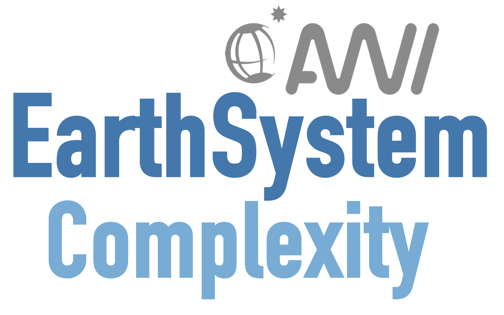

::: {.hero}
{.hero-logo fig-alt="AWI Earth System Complexity logo"}

The Earth System Complexity group at AWI is focused on understanding
interactions between large-scale components of the Earth — the ice sheets and
ocean circulation, boreal forest and permafrost. We strive to increase our
understanding of the relevant processes driving dynamics within these systems
on long timescales, using numerical models and paleo data analysis.
:::

## Some publications

::: {.publications}

Bochow, N., Poltronieri, A., Robinson, A., Montoya, M., Rypdal, M. and Boers, N.: Overshooting the critical threshold for the Greenland ice sheet, *Nature*, 622, 528–536, [doi.org/10.1038/s41586-023-06503-9](https://doi.org/10.1038/s41586-023-06503-9), 2023.

Swierczek‐Jereczek, J., Robinson, A., Blasco, J., Alvarez‐Solas, J. and Montoya, M.: Time‐scale synchronisation of oscillatory responses can lead to non‐monotonous R‐tipping, *Scientific Reports*, 13, 2104, [doi.org/10.1038/s41598-023-28771-1](https://doi.org/10.1038/s41598-023-28771-1), 2023.

Moreno-Parada, D., Alvarez-Solas, J., Blasco, J., Montoya, M., and Robinson, A.: Simulating the Laurentide Ice Sheet of the Last Glacial Maximum, *The Cryosphere*, 17, 2139–2156, [doi.org/10.5194/tc-17-2139-2023](https://doi.org/10.5194/tc-17-2139-2023), 2023.

:::

## Some tools we use

::: {.tool-card}
### Yelmo ice sheet model

A higher-order continental-scale ice sheet model.

Robinson, A., Alvarez-Solas, J., Montoya, M., Goelzer, H., Greve, R., and Ritz, C.: Description and validation of the ice-sheet model Yelmo (version 1.0), *Geosci. Model Dev.*, 13, 2805–2823, [doi.org/10.5194/gmd-13-2805-2020](https://doi.org/10.5194/gmd-13-2805-2020), 2020.

[<i class="bi bi-github"></i> palma-ice/yelmo](https://github.com/palma-ice/yelmo){.repo-link}
:::

::: {.tool-card}
### CLIMBER-X climate model

A fast Earth system model (fESM) capable of long timescale simulations.

Willeit, M., Ganopolski, A., Robinson, A., and Edwards, N. R.: The Earth system model CLIMBER-X v1.0 – Part 1: Climate model description and validation, *Geosci. Model Dev.*, 15, 5905–5948, [doi.org/10.5194/gmd-15-5905-2022](https://doi.org/10.5194/gmd-15-5905-2022), 2022.
:::

::: {.tool-card}
### FastIsostasy

A regional glacial isostatic adjustment model.

Swierczek-Jereczek, J., Montoya, M., Latychev, K., Robinson, A., Alvarez-Solas, J., and Mitrovica, J.: FastIsostasy v1.0 – An accelerated regional GIA model accounting for the lateral variability of the solid Earth, *EGUsphere [preprint]*, [doi.org/10.5194/egusphere-2023-2869](https://doi.org/10.5194/egusphere-2023-2869), 2023.

[<i class="bi bi-github"></i> JanJereczek/FastIsostasy.jl](https://github.com/JanJereczek/FastIsostasy.jl){.repo-link}
:::

## Where to find us

Alfred Wegener Institute, Helmholtz Centre for Polar and Marine Research
Bremerhaven, Germany
